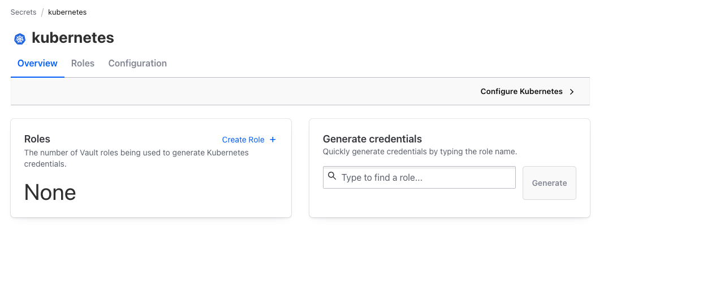
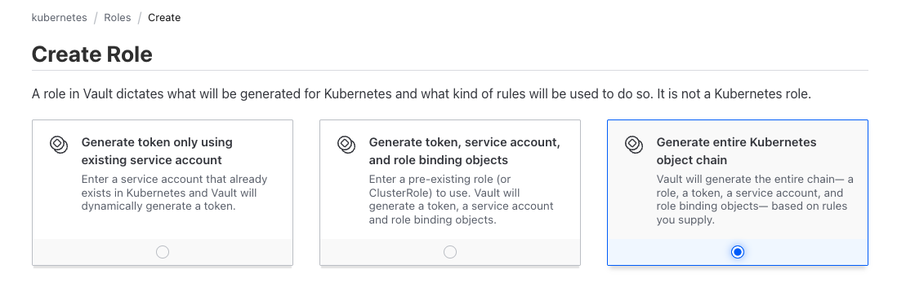
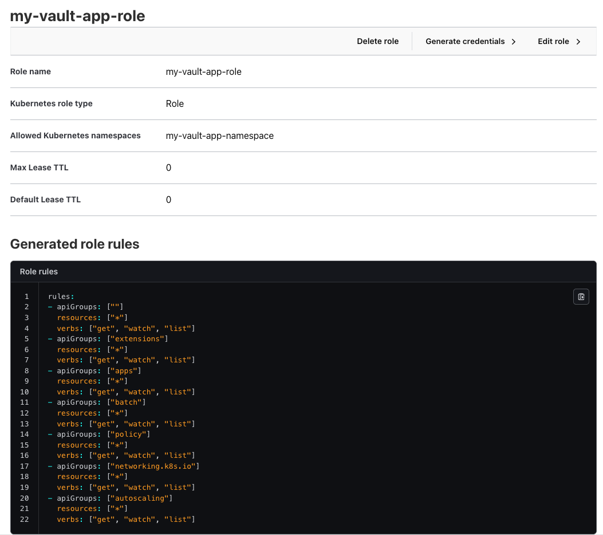

= Secrets Management with HashiCorp Vault

== Module Overview

**Duration:** 25 minutes +
**Format:** Hands-on lab +
**Audience:** Platform Engineers, Security Engineers, IT Operations

== Learning Objectives

By the end of this module, you will:

* Deploy HashiCorp Vault on OpenShift
* Configure the Vault Kubernetes secrets engine and deploy an application that ingests the generated credential chain

== Deploy Vault

The cluster provisioning script installs Vault into the `vault` namespace. Move on to the next step while vault is installing to get an understanding as to why we are using Vault in this lab.

.Procedure
. Run the following command in your terminal to install Vault:

[source,bash,subs="+macros,+attributes",role=execute]
----
git clone https://github.com/mfosterrox/openshift-days-ops-showroom.git
cd openshift-days-ops-showroom/setup-scripts
./install-vault.sh
----

The install script:
* Installs Vault in **dev mode** for the lab (auto-initialized, auto-unsealed; **not for production**)
* Creates an OpenShift **Route** at `vault.apps.<cluster-domain>`
* Requests a **cert-manager** route certificate so the TLS name matches the Route host
* Enables the **Vault Agent Injector** for Kubernetes secret injection patterns

OUTPUT:
[source,bash]
----
[VAULT] Dev mode token (lab only): root
[VAULT] CLI: export VAULT_ADDR="https://vault.apps.cluster-nxxq9.dynamic2.redhatworkshops.io" VAULT_TOKEN=root
[VAULT] Done.
----

== Secrets Management in Kubernetes and OpenShift

Platform teams on Kubernetes and OpenShift hit a recurring secrets gap. In Kubernetes, native secrets can mount credentials, but they rarely meet enterprise needs for governance, rotation, revocation, and consistent use across clusters, clouds, and non-Kubernetes systems. OpenShift adds hardening to clusters, but at scale the question shifts from “how do I get a secret into my pod?” to “how do I run the full lifecycle without blocking developers?”. Red Hat created the External Secrets Operator to help platform teams manage secrets across clusters, clouds, and non-Kubernetes systems.

image::vault-sm-00.png[External Secrets Operator, link=self, window=blank, width=100%]

The External Secrets Operator is a Kubernetes operator that manages secrets from various sources like GCP, AWS, Azure, and HashiCorp Vault. The External Secrets Operator is a great tool for flexibility, but for lab purposes, we will use HashiCorp Vault so that we can have an secrets provider that we can use to inject secrets into our workloads, locally, in the workshop environment.

== About HashiCorp Vault on Kubernetes

HashiCorp Vault stores and brokers access to secrets, certificates, and encryption keys. For production on OpenShift, HashiCorp recommends the Vault Secrets Operator (VSO) for full lifecycle automation; this lab uses the official https://github.com/hashicorp/vault-helm[Vault Helm chart] with the Vault Agent Injector so you can deliver secrets to pods and configure Kubernetes authentication hands-on.

For most Vault shops, VSO is the best balance of security, automation, and developer experience: apps keep using Kubernetes Secrets while Vault stays the system of record; use VSO protected secrets when policy forbids secrets in cluster state. Vault Enterprise (namespaces, Sentinel, HA/replication) supports that model at scale. Red Hat also offers a supported External Secrets Operator for provider-neutral sync; for Vault specifically, VSO remains the purpose-built path. This module’s hands-on work deploys Vault and uses the Agent Injector to show delivery and Kubernetes auth-the same problem VSO addresses in a more scalable, operator-native way.

== Sign in to the Vault UI

You can access the application via the a separate browser tab or window (ctrl + click on the URL to open URLs in a new tab): 

[source,bash,subs="+macros,+attributes",role=execute]
----
echo "https://$(oc get route vault -n vault -o jsonpath='{.spec.host}')/"
----

Administrator login is available with:

[cols="1,1"]
|===
| *Vault Console Method:* | Token
| *Vault Console Password:* | root
|===

== Create a Kubernetes Secrets Engine in Vault

Vault secrets engines are used to store and manage secrets. The most common secrets engine is the Key/Value (KV) secrets engine. The KV secrets engine is used to store and manage secrets in a key/value store. The Kubernetes secrets engine is used to store and manage secrets in a Kubernetes secret store.

.Procedure
. Click on the *Enable new engine* button on the top right of the page.
+
image::vault-sm-01.png[Enable new engine, link=self, window=blank, width=100%]
+
. Click on the *Kubernetes* button.
+
image::vault-sm-02.png[Enable Kubernetes secrets engine, link=self, window=blank, width=100%]
+
. Click on the *Enable engine* tab.
+
image::vault-sm-03.png[Enable engine, link=self, window=blank, width=100%]
+
. Click on *Configure Kubernetes*
+
image::vault-sm-04.png[Configure Kubernetes, link=self, window=blank, width=100%]
+
. Click on the *Get config values* button, then click *Save*.
+
image::vault-sm-05.png[Get config values, link=self, window=blank, width=100%]
+
. Click on the *Save* button.
+
image::vault-sm-06.png[Save, link=self, window=blank, width=100%]
+
. You should see the new secrets engine listed in the *Secrets Engines* tab.
+
image::vault-sm-07.png[Secrets engines, link=self, window=blank, width=100%]
+

== Create a Role in Vault for your application

A role in the Vault Kubernetes secrets engine is **not** a Kubernetes `Role`. It defines how Vault generates credentials for the cluster-anything from a token for an existing service account to a full chain of Kubernetes objects.

Vault offers three generation modes:

* *Generate token only using existing service account* - Vault returns a token for a service account you already created.
* *Generate token, service account, and role binding objects* - Vault creates a service account and role binding against a Kubernetes `Role` or `ClusterRole` you specify.
* *Generate entire Kubernetes object chain* - Vault creates the Kubernetes `Role`, service account, role binding, and token from rules you supply (used in this lab).

.Procedure
. From the Kubernetes secret engine, click on the *Create Role +* link.
+

+
. Highlight the *Generate entire Kubernetes object chain*.
+

+
. Give the role a name of *my-vault-app-role* and click on the *Create* button.
+
[source,bash,role="copypaste"]
----
my-vault-app-role
----
+
. Select *Role*
. Under "Allowed Kubernetes namespaces" enter *my-vault-app-namespace*
+
[source,bash,role="copypaste"]
----
my-vault-app-namespace
----
+
. Under *Generated role rules*, select *Read resources in namespace*.
. Click *Save*
+

== Deploy an application that ingests the Kubernetes credential chain

Your application pod authenticates to Vault with Kubernetes auth, then the Vault Agent requests credentials from `kubernetes/creds/my-vault-app-role`. Vault generates the full object chain in `my-vault-app-namespace` and returns the service account name, namespace, and token. The app reads those values from `/vault/secrets/k8s-creds` and calls the Kubernetes API with the Vault-issued token.

.Procedure
. Configure Vault CLI access on the bastion (if you have not already):
+
[source,bash,subs="+macros,+attributes",role=execute]
----
export VAULT_ADDR="$(oc get route vault -n vault -o jsonpath='https://{.spec.host}')"
export VAULT_TOKEN=root
export VAULT_SKIP_VERIFY=true
cd openshift-days-ops-showroom/setup-scripts
----

. Allow the workshop application service account to request credentials from the Kubernetes secrets engine:
+
[source,bash,subs="+macros,+attributes",role=execute]
----
./configure-vault-k8s-chain-auth.sh
----

. Deploy the sample application (namespace, bootstrap service account, Vault Agent annotations):
+
[source,bash,subs="+macros,+attributes",role=execute]
----
oc apply -f demo-vault-k8s-chain-app.yaml
oc get pods -n my-vault-app-namespace -w
----

Press `Ctrl+C` when the pod is `2/2` Ready (application + Vault Agent init container).

. Confirm Vault created Kubernetes objects for the generated chain in `my-vault-app-namespace`:
+
[source,bash,subs="+macros,+attributes",role=execute]
----
oc get sa,role,rolebinding -n my-vault-app-namespace
----

You should see a Vault-generated service account and role binding in addition to the bootstrap `my-vault-app` service account used only to authenticate to Vault.

. Verify the application ingested the credential chain and called the API:
+
[source,bash,subs="+macros,+attributes",role=execute]
----
POD=$(oc get pod -n my-vault-app-namespace -l app=my-vault-app -o jsonpath='{.items[0].metadata.name}')
oc logs -n my-vault-app-namespace "${POD}" -c app --tail=30
----

Expected output includes redacted `SERVICE_ACCOUNT_*` fields and a JSON fragment listing pods in `my-vault-app-namespace`.

. Optional: inspect the rendered credentials file (token is redacted in application logs):
+
[source,bash,subs="+macros,+attributes",role=execute]
----
oc exec -n my-vault-app-namespace "${POD}" -c app -- cat /vault/secrets/k8s-creds | sed 's/SERVICE_ACCOUNT_TOKEN=.*/SERVICE_ACCOUNT_TOKEN=***redacted***/'
----

. Optional: remove the demo when finished:
+
[source,bash,subs="+macros,+attributes",role=execute]
----
oc delete -f demo-vault-k8s-chain-app.yaml
----

=== What you learned

* The Vault Kubernetes secrets engine role `my-vault-app-role` mints a **credential chain** (Kubernetes `Role`, service account, role binding, and token) instead of storing static secrets in etcd.
* The **Vault Agent Injector** renders that chain into the pod at `/vault/secrets/k8s-creds` using a template that POSTs to `kubernetes/creds/<role>` with `kubernetes_namespace`.
* Your application **ingests** the chain at runtime and uses the Vault-issued token to call the Kubernetes API-no long-lived credentials in the image or Git.

=== References

* Kubernetes secrets engine - https://developer.hashicorp.com/vault/docs/secrets/kubernetes
* Kubernetes auth method - https://developer.hashicorp.com/vault/docs/auth/kubernetes
* Vault Agent Injector - https://developer.hashicorp.com/vault/docs/platform/k8s/injector/annotations

== Clean up (optional)

[source,bash,subs="+macros,+attributes",role=execute]
----
cd setup-scripts
./uninstall-vault.sh
----

**Great job!** You have a working Vault instance on OpenShift. Continue when you are ready for the next topic in the workshop.
